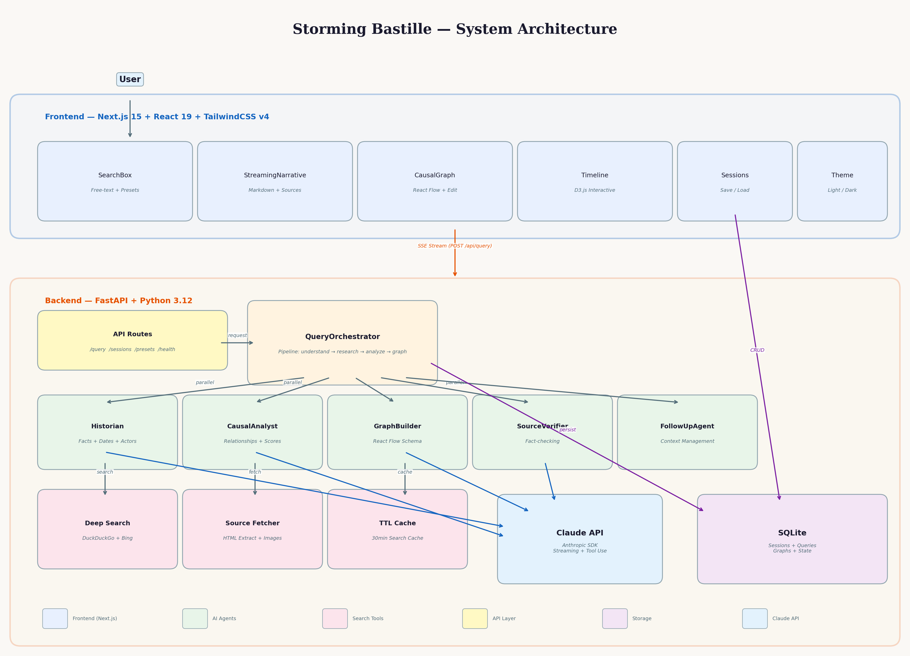

# Storming Bastille

**Discover the hidden connections between historical events.**

Storming Bastille is an AI-powered web application that finds causal relationships between historical events. Ask any question about history and receive a streaming, interactive analysis complete with causal graphs, timelines, verified sources, and rich narrative explanations.



## Features

- **Free-text historical queries** — Ask anything: "How did the Seven Years' War reshape global power?" or "What connected the fall of Rome to the Renaissance?"
- **Streaming AI responses** — Real-time narrative generation with Claude, streamed to the UI as it's written
- **Interactive causal graphs** — Drag, edit, and explore event relationships in a React Flow visualization
- **Timeline view** — D3.js-powered chronological timeline with zoom and pan
- **Multi-source verification** — DuckDuckGo + Bing parallel search with cross-verification
- **Follow-up questions** — Ask follow-ups with full conversation context
- **Save and load sessions** — Persist your research and return to it later
- **Beautiful UI** — Warm, scholarly design with dark mode support
- **Preset prompts** — 12 curated starter questions across 6 historical categories

## Tech Stack

### Backend
| Technology | Purpose |
|-----------|---------|
| Python 3.12 | Runtime |
| FastAPI | Async web framework with SSE streaming |
| Anthropic SDK | Claude API for reasoning and analysis |
| DuckDuckGo + Bing | Parallel web search for historical sources |
| SQLite (aiosqlite) | Session persistence |
| pydantic-settings | Configuration management |

### Frontend
| Technology | Purpose |
|-----------|---------|
| Next.js 15 | React framework with App Router |
| React 19 | UI library |
| TailwindCSS v4 | Utility-first styling |
| React Flow (@xyflow/react) | Interactive causal graph |
| D3.js | Timeline visualization |
| Motion (Framer Motion) | Animations |
| Zustand | State management |

### AI Agent Pipeline
```
User Query
    |
    v
Intent Understanding (extract entities, time period, scope)
    |
    v
Phase 1 (Parallel):
  - Historian Agent (research + web search)
  - Source Verifier (cross-reference claims)
    |
    v
Phase 2 (Sequential):
  - Causal Analyst (identify relationships)
  - Graph Builder (create visualization schema)
    |
    v
SSE Stream to Frontend (narrative + graph + timeline + sources)
```

## Prerequisites

- **Python 3.12+** — `python3 --version`
- **uv** — Python package manager (`curl -LsSf https://astral.sh/uv/install.sh | sh`)
- **Bun** — JavaScript runtime and package manager (`curl -fsSL https://bun.sh/install | bash`)
- **Anthropic API Key** — Get one at https://console.anthropic.com/settings/keys

## Quick Start

### 1. Clone and configure

```bash
cd storming-bastille
cp .env.example backend/.env
```

Edit `backend/.env` and add your Anthropic API key:
```
ANTHROPIC_API_KEY=sk-ant-...
```

### 2. Start everything

```bash
./start.sh
```

This will:
- Install backend Python dependencies (via uv)
- Install frontend Node dependencies (via bun)
- Start the FastAPI backend on http://localhost:8000
- Start the Next.js frontend on http://localhost:3000

### 3. Open the app

Visit **http://localhost:3000** in your browser.

### 4. Stop servers

```bash
./stop.sh
```

## Manual Setup

If you prefer to start services individually:

### Backend

```bash
cd backend
uv sync
uv run uvicorn app.main:app --host 0.0.0.0 --port 8000 --reload
```

### Frontend

```bash
cd frontend
bun install
bun dev
```

## Project Structure

```
storming-bastille/
├── CLAUDE.md                     # Claude Code project conventions
├── README.md                     # This file
├── system_architecture.png       # Architecture diagram
├── start.sh / stop.sh            # Server management scripts
├── .env.example                  # Environment template
│
├── backend/
│   ├── app/
│   │   ├── main.py               # FastAPI app entry point
│   │   ├── core/                  # Config, Anthropic client, cache
│   │   ├── agents/                # AI agent pipeline
│   │   │   ├── orchestrator.py    # Central query coordinator
│   │   │   ├── historian.py       # Historical research + web search
│   │   │   ├── causal_analyst.py  # Causal relationship identification
│   │   │   ├── graph_builder.py   # React Flow schema generation
│   │   │   ├── source_verifier.py # Cross-verification
│   │   │   └── followup.py        # Conversation context management
│   │   ├── tools/                 # Web search, content extraction
│   │   ├── api/routes/            # HTTP endpoints
│   │   ├── schemas/               # Pydantic data models
│   │   └── db/                    # SQLite database layer
│   └── tests/
│
├── frontend/
│   └── src/
│       ├── app/                   # Next.js pages
│       ├── components/
│       │   ├── search/            # SearchBox, PresetPrompts
│       │   ├── graph/             # CausalGraph, EventNode, CausalEdge
│       │   ├── timeline/          # D3 Timeline
│       │   ├── results/           # StreamingNarrative, Sources, FollowUp
│       │   └── sessions/          # Save/Load sessions
│       ├── hooks/                 # Custom React hooks
│       └── lib/                   # API client, SSE, utilities
│
├── .agents/                       # Claude agent definitions
└── .claude/                       # Claude Code settings, skills, hooks
```

## API Endpoints

| Method | Path | Description |
|--------|------|-------------|
| POST | `/api/query` | Submit query, returns SSE stream |
| GET | `/api/presets` | Get starter prompt suggestions |
| GET | `/api/sessions` | List saved sessions |
| GET | `/api/sessions/:id` | Load a saved session |
| POST | `/api/sessions` | Save/name a session |
| DELETE | `/api/sessions/:id` | Delete a session |
| PATCH | `/api/sessions/:id/graph` | Save edited graph |
| GET | `/health` | Health check |

## Configuration

All configuration is via environment variables in `backend/.env`:

| Variable | Default | Description |
|----------|---------|-------------|
| `ANTHROPIC_API_KEY` | — | Your Anthropic API key (required) |
| `BACKEND_HOST` | `0.0.0.0` | Backend bind host |
| `BACKEND_PORT` | `8000` | Backend port |
| `FRONTEND_URL` | `http://localhost:3000` | Frontend URL (for CORS) |
| `DATABASE_PATH` | `data/bastille.db` | SQLite database path |
| `LOG_LEVEL` | `INFO` | Logging level |

## Development

### Running tests
```bash
cd backend && uv run pytest tests/ -v
```

### Linting
```bash
cd backend && uv run ruff check app/ --fix
cd backend && uv run ruff format app/
```

### Architecture diagram
```bash
python3 scripts/generate_architecture.py
```

## How It Works

1. **User submits a question** about historical events
2. **Intent understanding** extracts key entities, time period, and geographic scope
3. **Historian agent** researches events using parallel DuckDuckGo + Bing searches, verifying dates and facts
4. **Source verifier** cross-references claims against multiple sources
5. **Causal analyst** identifies cause-effect relationships with confidence scores
6. **Graph builder** creates a React Flow-compatible visualization schema
7. **Results stream** to the frontend via SSE — narrative text, causal graph, timeline, and sources appear progressively
8. **User can interact** — edit the graph, ask follow-up questions, and save their research

## License

MIT
